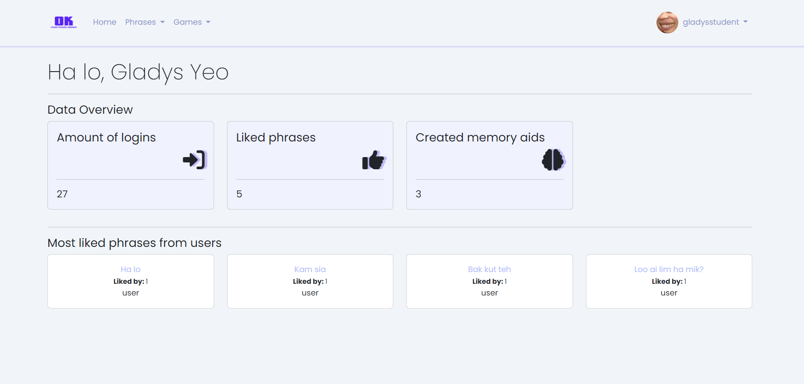
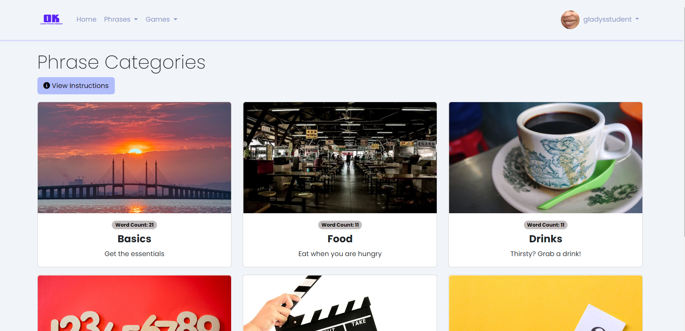
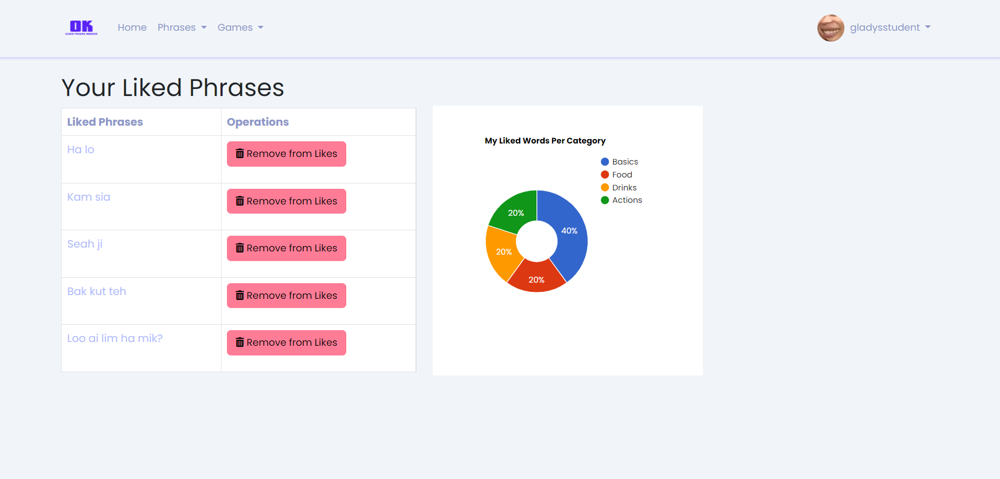
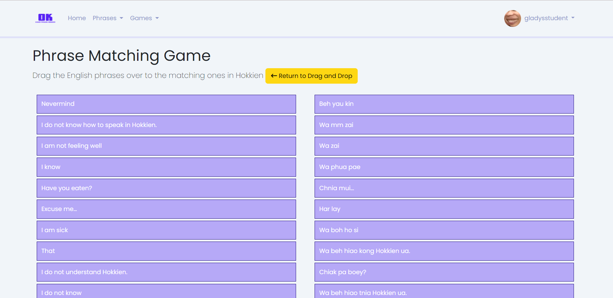
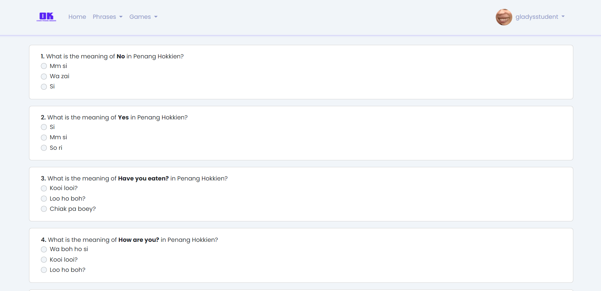

<h1>Ok Learn Penang Hokkien</h1>
Hello, thank you for visiting this repository. Ok Learn Penang Hokkien is a web application that offers phrasebook-styled lessons in Penang Hokkien, as well as basic game mechanics such as quiz and drag and drop. The website is made using Laravel as the backend solution and Bootstrap as the UI framework. 

<h1>Installation project</h1>
After cloning the project, here are the steps to perform in a command prompt of your choice:
<ol>
<li>Run composer install</li>
<li>Run cp .env.example .env</li>
<li>Run php artisan key:generate</li>
<li>Import the database (303comdb(1)) in any PHPMySQL database management of your choice</li>
<li>Run npm install and npm run dev to enable asset bundling in the frontend</li>
<li>Run php artisan serve</li>
<li>Please login with username <b>tester</b> and password<b>password</b></li>
</ol>

<h1>Some screenshots of the web application's features</h1>
<h3>Homepage</h3>

<h3>Phrase Categories</h3>

<h3>Liked Phrases</h3>

<h3>Games - Drag and Drop</h3>

<h3>Games - Quiz</h3>

<h1>Penang Hokkien Resources</h1>
To learn Penang Hokkien, it is been suggested that users can start looking into the resources listed below
<ul>
<li><a href="https://www.penang-traveltips.com/penang-hokkien.htm">Learn to Read and Write Hokkien in 10 minutes</a></li>
<li><a href="https://www.penang-traveltips.com/penang-hokkien.htm">Timothy Tye's Penang Hokkien Resources</a></li>
<li><a href="https://penanghokkien.com/">Penang Hokkien Podcast (if you are an intermediate or advanced level Penang Hokkien speaker)</a></li>
<li><a href="https://www.youtube.com/@TheJingProductions/videos">Jing Jing Beh has some decent Penang Hokkien content with English and Mandarin subtitles</a></li>
</ul>

